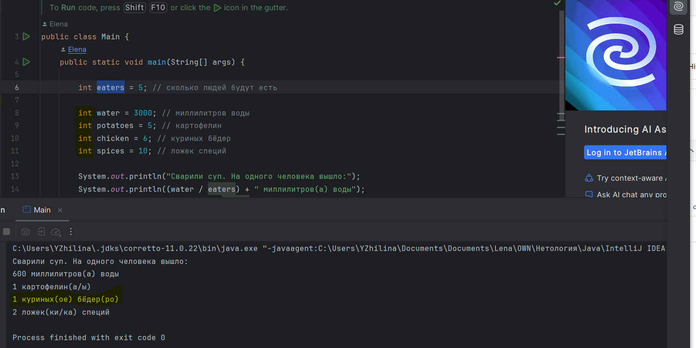

# Описание
Для отображения результатов вычислений выбран некорректный тип даных. Согласно условию должно быть подсчитано точное количество ингредиентов без округлений, соответственно для вывода данных должен использоваться тип переменной double.

# Локация дефекта
https://github.com/ElenaZhilina/JavaQA/blob/3e3e1a6a6acc613f80ca71a892eb9e146cd0522c/src/Main.java#L8  
https://github.com/ElenaZhilina/JavaQA/blob/09280ef08213c8c81e53d054803c663d68bac862/src/Main.java#L11  

# Шаги воспроизведения

1. Открыть [код программы] (https://github.com/ElenaZhilina/JavaQA/blob/3e3e1a6a6acc613f80ca71a892eb9e146cd0522c/src/Main.java)
2. Выставить значение переменной "eaters" (сколько людей будут есть) в 5
3. Выставить значение переменной "water" (миллилитров воды) в 3000
4. Выставить значение переменной "potatoes" (картофелин) в 5
5. Выставить значение переменной "chicken" (куриных бёдер) в 6
6. Выставить значение переменной "spices" (ложек специй) в 10
7. Запустить программу
8. Посмотреть на вывод в консоли

*Ожидаемый результат:* 
Сварили суп. На одного человека вышло:  
600 миллилитров(а) воды  
1 картофелин(а/ы)  
**1.2 куриных(ое) бёдер(ро)**  
2 ложек(ки/ка) специй  

*Фактический результат:*
Сварили суп. На одного человека вышло:  
600 миллилитров(а) воды  
1 картофелин(а/ы)  
**1 куриных(ое) бёдер(ро)**  
2 ложек(ки/ка) специй  

# Скриншот

# Окружение
* **Операционная система:** Windows 10 Pro версия 22H2
* **IDE:** IntelliJ IDEA 2023.3.4 (Ultimate)
* **Java:** OpenJDK 11